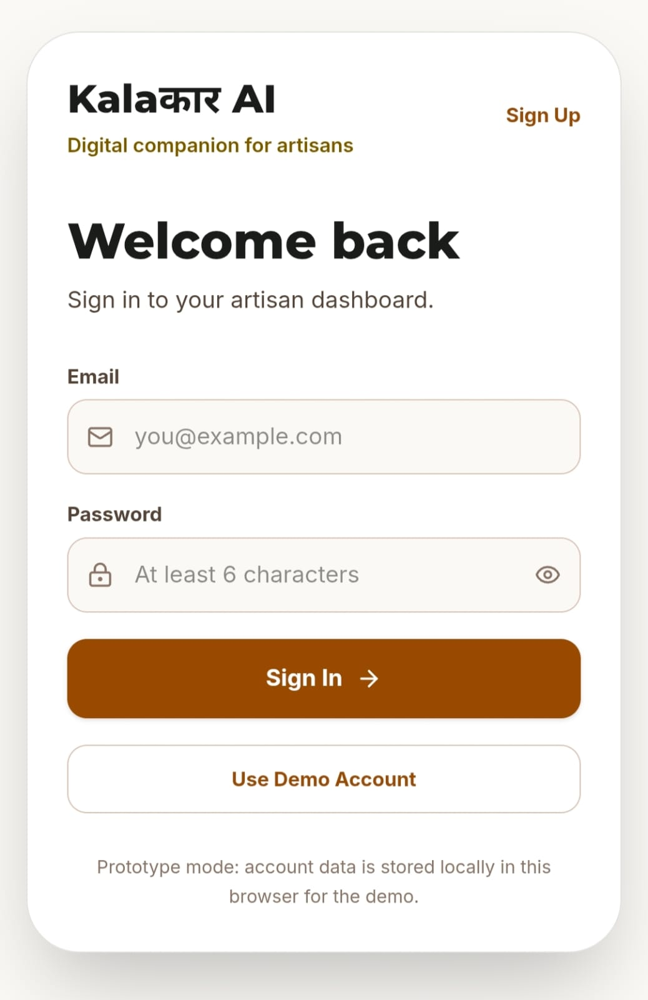
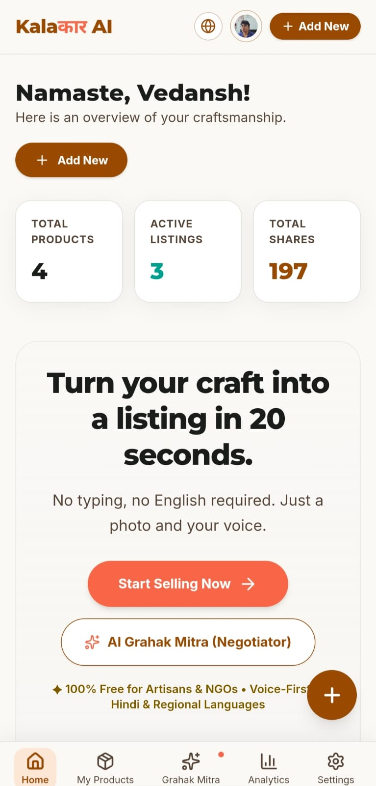
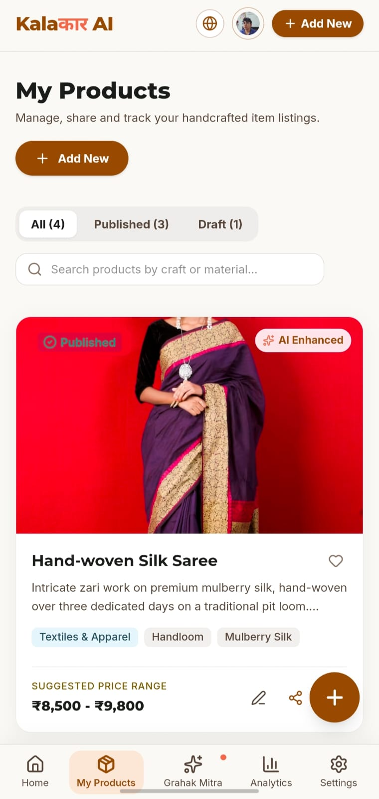
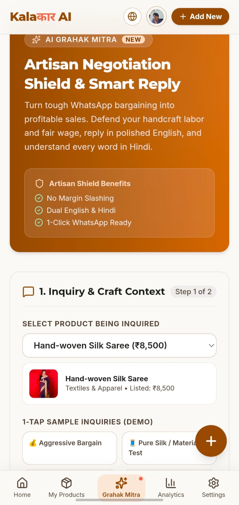
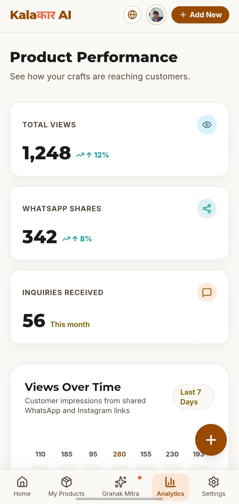
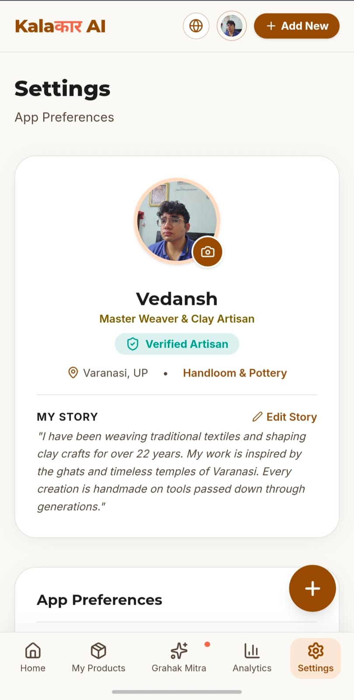

# Kalaakar AI — From Craft to Commerce

> **Transforming every artisan into a digitally empowered entrepreneur through a simple, AI-driven virtual business manager.**

Kalaakar AI is an AI-powered digital commerce assistant designed to help Indian artisans and craftspeople easily take their handmade products from **craft to commerce**.

The platform allows an artisan to provide a **photo and voice description** of their product and converts it into a market-ready digital listing with multilingual content, AI-powered visuals, pricing assistance, and buyer matching.

[](https://kalakar-ai.vercel.app/)

---

##  Problem Statement

Many Indian artisans and traditional craftspeople create high-quality handmade products but face difficulties in bringing them to digital marketplaces.

Major challenges include:

- Difficulty creating professional product listings
- Language barriers while selling online
- Limited digital and technical skills
- Difficulty creating attractive product images
- Lack of knowledge about competitive pricing
- Limited access to suitable buyers and markets
- Dependence on intermediaries for selling products

These challenges can prevent artisans from reaching wider markets and receiving fair value for their work.

---

##  Our Solution

**Kalaakar AI** acts as a simple virtual business manager for artisans.

An artisan can simply:

**Capture Product → Describe by Voice → AI Processes → Generate Listing → Set Price → Connect with Buyers**

The system reduces the technical effort required to digitally sell handmade products.

### Core Capabilities

-  **Photo-Based Product Input**
-  **Voice-Based Product Description**
-  **AI-Powered Listing Generation**
-  **Multilingual Content**
-  **AI-Powered Product Images**
-  **Pricing Assistance**
-  **Buyer Matching**
-  **Simple Artisan-Friendly Interface**

---
## Screenshots

**Kalaakar AI — a digital companion for artisans.**  
One platform to showcase crafts, manage products, understand customer interest, and negotiate better.

| Sign In | Artisan Dashboard | My Products |
|---|---|---|
|  |  |  |

| AI Grahak Mitra | Analytics | Settings |
|---|---|---|
|  |  |  |

---

##  Vision

Our vision is to make digital commerce accessible to every artisan by removing technical, language, and market-access barriers.

### We aim to:

- Enable easy digitization of artisan products
- Break language barriers
- Provide year-round market access
- Empower artisans to become digitally independent
- Support fair and competitive pricing

These objectives are directly aligned with the project's SIH idea submission.

---

##  How Kalaakar AI Works

```text
                ┌──────────────────┐
                │     ARTISAN      │
                └────────┬─────────┘
                         │
                 Product Photo
                         +
                  Voice Description
                         │
                         ▼
              ┌─────────────────────┐
              │    Kalaakar AI   │
              │    AI Processing     │
              └──────────┬──────────┘
                         │
          ┌──────────────┼──────────────┐
          ▼              ▼              ▼
     AI Listing      Translation     AI Visuals
     Generation       / Language      Generation
          │              │              │
          └──────────────┼──────────────┘
                         ▼
                 Pricing Assistance
                         │
                         ▼
                   Buyer Matching
                         │
                         ▼
              ┌─────────────────────┐
              │  MARKET-READY       │
              │  PRODUCT LISTING    │
              └─────────────────────┘
```

---

##  AI Features

### 1. AI Listing Generation

The artisan does not need to manually write a professional product description.

AI converts the provided product information into:

- Product title
- Product description
- Product highlights
- Craft information
- Suitable marketplace content

---

### 2. Voice-to-Listing

Artisans can describe their product naturally using their voice.

```text
Artisan Voice
      ↓
Speech Recognition
      ↓
AI Understanding
      ↓
Product Information
      ↓
Market-Ready Listing
```

This reduces the need for typing and makes the platform easier to use for artisans with limited digital literacy.

---

### 3. Multilingual Support

Kalaakar AI is designed to reduce language barriers between artisans and digital marketplaces.

The platform supports multilingual content generation so that artisans can communicate their products to a wider audience.

---

### 4. AI-Powered Product Images

The system can assist artisans in creating attractive digital product visuals from their product information.

This helps improve the presentation of handmade products in online marketplaces.

---

### 5. Pricing Assistance

Kalaakar AI aims to help artisans understand suitable and competitive pricing for their products.

The objective is to support **fair and competitive pricing** rather than forcing artisans to depend completely on intermediaries.

---

### 6. Buyer Matching

The platform can help connect products with potentially relevant buyers based on product characteristics and marketplace requirements.

This can improve the discoverability of traditional crafts.

---

##  Technical Approach

The proposed technical approach follows an AI-driven pipeline:

```text
User Input
   │
   ├── Product Image
   │
   └── Voice Description
            │
            ▼
      Input Processing
            │
            ▼
       AI Processing
            │
     ┌──────┼───────┐
     ▼      ▼       ▼
  Content  Image   Pricing
 Generation Generation Analysis
     │      │       │
     └──────┼───────┘
            ▼
    Multilingual Output
            │
            ▼
      Buyer Matching
            │
            ▼
      Digital Commerce
```

The SIH proposal identifies the technical approach, idea flowchart, implementation methodology and technologies as core components of the solution.

---

##  Key Benefits

| Challenge | Kalaakar AI Solution |
|---|---|
| Difficult listing creation | AI-generated listings |
| Typing difficulties | Voice-based input |
| Language barriers | Multilingual content |
| Poor product presentation | AI-powered visuals |
| Pricing uncertainty | Pricing assistance |
| Limited market reach | Buyer matching |
| Digital dependency | Simple self-service workflow |

---

##  Target Users

Kalaakar AI is primarily designed for:

- Traditional artisans
- Handicraft makers
- Handloom weavers
- Rural craftspeople
- Small-scale craft businesses
- Independent handmade-product sellers

---

##  Expected Impact

Kalaakar AI aims to create impact by:

- Increasing digital participation of artisans
- Improving product discoverability
- Reducing language barriers
- Reducing dependence on intermediaries
- Helping artisans reach broader markets
- Supporting competitive pricing
- Encouraging digital entrepreneurship

The project's stated vision specifically focuses on digitization, language access, year-round market access and digital independence for artisans.

---

##  Future Scope

Potential future enhancements include:

- Integration with major e-commerce marketplaces
- WhatsApp-based commerce
- Social-commerce integration
- Regional language expansion
- Advanced market analytics
- Demand prediction
- Automated inventory management
- Personalized buyer recommendations
- Artisan performance analytics
- Digital payment integration
- Logistics and delivery integration

---

##  Research & References

The SIH idea submission references the following sources:

- **India Handmade — Government of India / Digital India**
- **Government of India — PIB**
- Research and information related to AI + artisans

The original proposal lists India Handmade and a Government of India PIB reference as research sources.

---

##  Technology Stack

> Update this section with the exact technologies used in the final implementation.

### Frontend

- React
- TypeScript
- HTML5
- CSS

### Backend

- Node.js
- Express / API services

### AI

- Generative AI
- Speech Recognition
- Natural Language Processing
- AI Image Generation

### Database / Storage

- Add the database actually used by the project

### Deployment

- Add your final deployment platform here

---

##  Project Structure

```text
Kalaakar-AI/
│
├── src/
│   ├── components/
│   ├── pages/
│   ├── services/
│   ├── utils/
│   └── data/
│
├── public/
│
├── docs/
│
├── assets/
│   └── screenshots/
│
├── submission/
│   ├── PRESENTATION.md
│   └── DEMO.md
│
├── README.md
├── SUBMISSION_GUIDE.md
├── package.json
└── .gitignore
```

---

##  Installation

### 1. Clone the repository

```bash
git clone <YOUR-GITHUB-REPOSITORY-URL>
cd Kalaakar-AI
```

### 2. Install dependencies

```bash
npm install
```

### 3. Configure environment variables

Create a `.env.local` file and add the required API configuration.

```env
API_KEY=your_api_key
```

> Never commit API keys, passwords, or other secrets to GitHub.

### 4. Start the development server

```bash
npm run dev
```

Open the local URL shown in your terminal.

---

##  Demo

A complete demonstration should cover:

1. Artisan enters the platform
2. Selects/adds a product
3. Provides product photo
4. Gives voice description
5. AI processes the information
6. Product listing is generated
7. Multilingual content is created
8. Product visuals are generated
9. Pricing assistance is displayed
10. Suitable buyers/market opportunities are presented

---

##  License

This project is developed for the **Smart India Hackathon**.

Add the appropriate open-source license here if the project is intended to be publicly licensed.

---

##  Our Mission

> **From Craft to Commerce.**

Kalaakar AI aims to bridge the gap between India's rich traditional craftsmanship and the modern digital marketplace.

**Every artisan deserves the opportunity to be digitally visible, economically empowered, and connected to the right market.**
